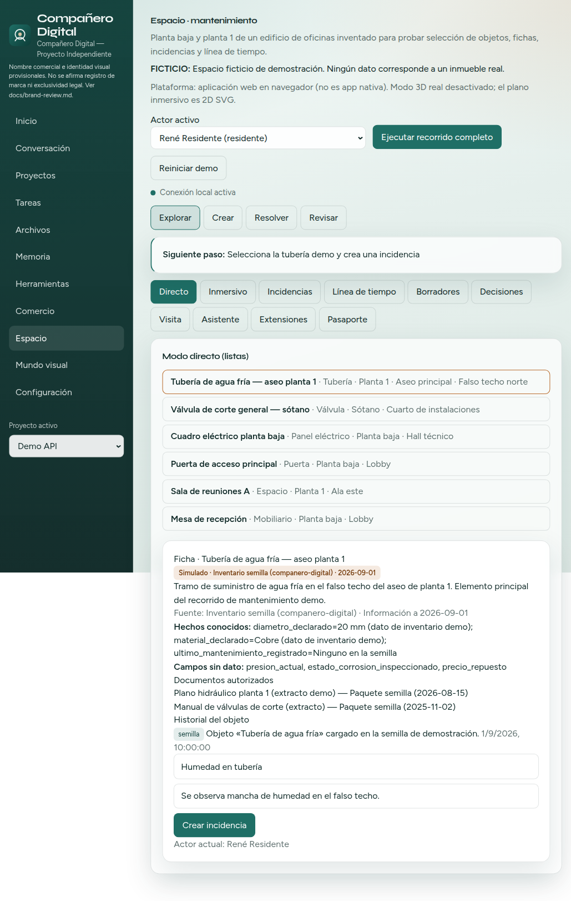
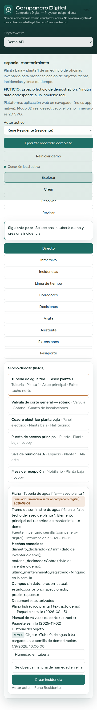

# Allviewser

> Repositorio GitHub provisional. La marca pública se configura en `src/lib/brand.ts` y **no** está registrada en esta entrega. Ver [docs/brand-review.md](docs/brand-review.md).

**Compañero Digital** — Proyecto Independiente (nombre público provisional)  
**Creador, fundador y CEO:** Pascasio Emmanuel Reynoso Reyes (@pascasio01)

Nombre comercial e identidad visual **provisionales** (sin símbolo ®). Candidato alternativo en estudio: Brainluk. Ningún nombre está confirmado como legalmente disponible.

English summary: see [English](#english) below.

## Estado real (0.2.2)

| Área | Estado |
|------|--------|
| Proyectos, memoria, tareas, archivos sandbox | Operativo |
| Conversación con modelo configurable | Operativo (sin simular si falta proveedor) |
| Taller con app CLI + pruebas | Operativo |
| Espacio / mantenimiento (edificio ficticio) | Operativo — recorrido completo con persistencia y roles |
| Comercio inmersivo | Sandbox aislado (sin cobros reales) |
| Voz / visión / 3D en vivo / remoto | No activos (declarado, no fingido) |
| Licencia de código | UNLICENSED — decisión del titular pendiente |

## Captura y demostración





- Capturas auténticas generadas desde la app en ejecución (`docs/screenshots/`).
- Demo local: `npm run dev` → http://localhost:3000/espacio
- Guía: [docs/guides/DEMO_ESPACIO.md](docs/guides/DEMO_ESPACIO.md)

## Funciones implementadas

- **Explorar / Crear / Resolver / Revisar** como intenciones explícitas.
- Modo directo (listas) y plano inmersivo 2D SVG.
- Fichas con procedencia: `en_vivo` · `periodico` · `grabado` · `estimado` · `simulado` · `generado`.
- Incidencias con roles, evidencias, cierre e historial persistente.
- Asistente contextual que declara «Información no disponible» si falta el dato.
- Guía de siguiente paso según actor; navegación móvil colapsable.

## Instalación comprobada

```bash
git clone https://github.com/pascasio01/Allviewser.git
cd Allviewser
npm install
cp .env.example .env.local   # opcional
npm run dev
```

```bash
npm test && npm run lint && npm run build && npm run secret-scan
```

Datos en `./data/` (ignorado por Git).

## Primer recorrido (mantenimiento)

1. Abrir `/espacio`.
2. Seleccionar la tubería de aseo planta 1 (lista o plano).
3. Revisar ficha y etiqueta **simulado**.
4. Con residente: crear incidencia.
5. Con administrador: asignar al técnico.
6. Con técnico: en progreso + evidencia demo.
7. Solicitar revisión.
8. Con revisor: verificar y cerrar.
9. Abrir línea de tiempo / pasaporte.
10. Reiniciar demo y comprobar semilla/persistencia.

## Configuración de modelos

1. Servidor local u OpenAI-compatible.
2. En **Configuración**: proveedor, URL, `modelId`.
3. Clave solo por nombre de variable de entorno.

Sin modelo: instrucciones reales; no se finge inteligencia.

## Matriz local / externa

| Capacidad | Local | Externa |
|-----------|-------|---------|
| Persistencia | Sí (`./data`) | No desplegada |
| Modelo | Opcional | Opcional (env) |
| Comercio / pagos | Sandbox | No |
| Voz / cámara en vivo | No | No |

## Costes

Node 20+, npm; Next.js 15 / React 19 / TypeScript / Vitest / Tailwind 4. Coste de modelo = tu proveedor (cero si no configuras).

## Fuentes y límites

Edificio e inventario: semilla **simulada**. Evidencias demo ≠ fotos de campo. Marca provisional (`docs/brand-review.md`).

## Arquitectura

UI → API routes → dominio (`space` / `commerce` / `tasks` / `models`) → `./data` → herramientas con grants. Ver [docs/ARCHITECTURE.md](docs/ARCHITECTURE.md), [docs/SPACE.md](docs/SPACE.md).

## Pruebas

`npm test` (35+), lint, build, secret-scan. Informe: [docs/VALIDATION_REPORT.md](docs/VALIDATION_REPORT.md).

## Hoja de ruta y comunidad

[ROADMAP.md](ROADMAP.md) · [CONTRIBUTING.md](CONTRIBUTING.md) · [CODE_OF_CONDUCT.md](CODE_OF_CONDUCT.md) · [SECURITY.md](SECURITY.md) · [CHANGELOG.md](CHANGELOG.md)

## Licencia y créditos

**UNLICENSED** hasta decisión del titular. Publicar código no otorga por sí solo licencia open source.  
Créditos: Pascasio Emmanuel Reynoso Reyes (creador, fundador y CEO); terceros en [THIRD_PARTY_NOTICES.md](THIRD_PARTY_NOTICES.md) / [docs/ACKNOWLEDGEMENTS.md](docs/ACKNOWLEDGEMENTS.md).

---

## English

**Allviewser** is a provisional GitHub repo name. Public product name (**Compañero Digital — Independent Project**) lives in `src/lib/brand.ts` and is **not** a registered trademark claim.

**Creator, founder & CEO:** Pascasio Emmanuel Reynoso Reyes (@pascasio01)

### What works (0.2.2)

Local-first companion: projects, memory, tasks, sandboxed files, honest model chat, workshop with real tests, isolated commerce sandbox, and **Space** maintenance demo with roles, evidence, timeline, persistence, and provenance labels (`live` / `periodic` / `recorded` / `estimated` / `simulated` / `generated`).

Voice, live 3D, and remote continuity are **not** active and are not faked.

### Quick start

```bash
npm install && npm run dev
```

Open `http://localhost:3000/espacio` — guide: `docs/guides/DEMO_ESPACIO.md`.

### License

`UNLICENSED` until the owner decides. Publication alone does not grant an open-source license.
