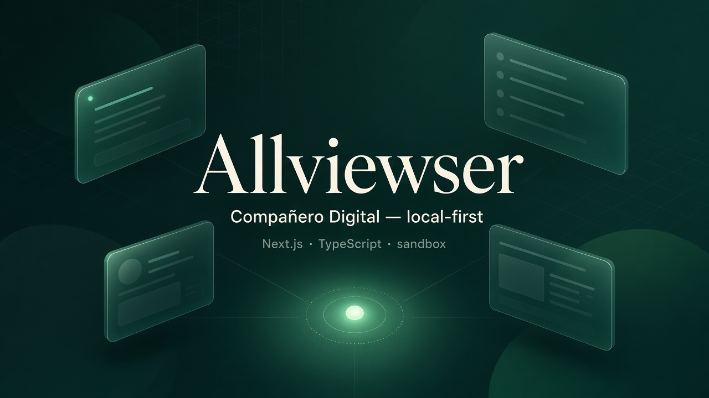
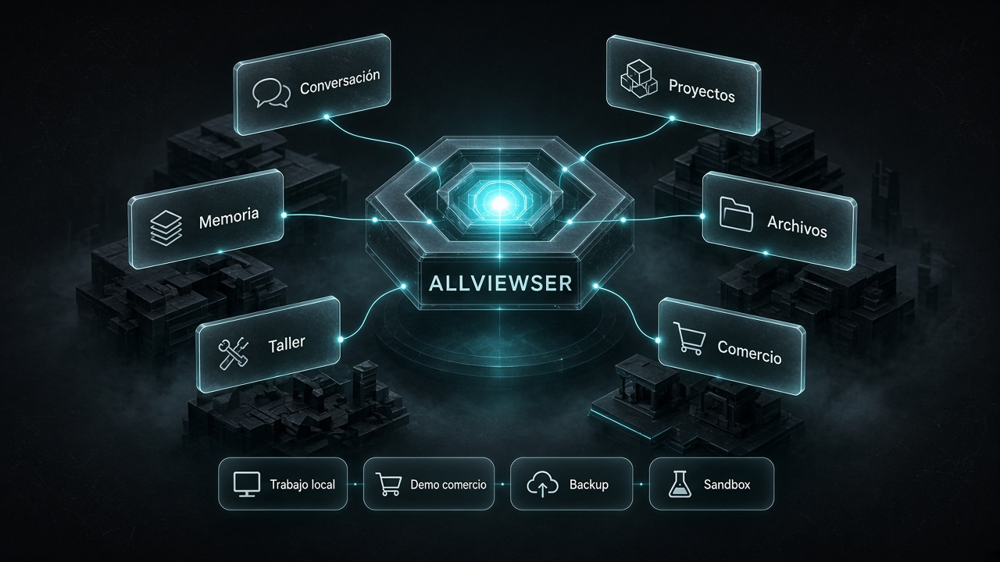

<p align="center">
  
</p>

<h1 align="center">Allviewser</h1>

<p align="center"><strong>El punto dulce entre “solo chat” y “montarte un stack desde cero”</strong> para trabajo digital local-first.</p>

<p align="center">
  Compañero de trabajo con proyectos, memoria aprobada, taller verificable, sandbox de archivos<br/>
  y un módulo de comercio inmersivo en demo — útil hoy, evolutivo mañana.
</p>

<p align="center">
  <a href="#probar-allviewser">Probar en local</a> ·
  <a href="#arranque-rápido">Arranque rápido</a> ·
  <a href="docs/ARCHITECTURE.md">Arquitectura</a> ·
  <a href="CONTRIBUTING.md">Aportar</a>
</p>

<p align="center">
  
  
  
  
  
  
  <a href="CODE_OF_CONDUCT.md"></a>
  
</p>

<p align="center">
  <strong>Compañero Digital</strong> — Proyecto Independiente<br/>
  Autor: <strong>Pascasio Emmanuel Reynoso Reyes</strong>
  (<a href="https://github.com/pascasio01">@pascasio01</a>)<br/>
  <em>Nombre comercial provisional · marca en <code>src/lib/brand.ts</code></em>
</p>

---

<p align="center">
  
</p>

<p align="center">
  
</p>

## ¿Qué es Allviewser?

Allviewser es una app web **local-first** que actúa como compañero digital de trabajo: conversas con modelos configurables, organizas proyectos, guardas memoria **aprobada**, ejecutas tareas, trabajas archivos en sandbox y generas apps pequeñas en un taller **con pruebas reales**.

No es un juguete de demos vacías ni una promesa de “IA omnisciente”. Es una base **poderosa, real y útil** que puedes mirar, correr y evolucionar.

### Casos de uso

- Centro de control personal / de equipo pequeño en tu máquina
- Taller para generar utilidades CLI con tests
- Memoria de hechos y decisiones (no alucinaciones persistentes)
- Demo de comercio inmersivo en sandbox (`/comercio`) — sin cobros reales
- Respaldo/restauración con checksum en el mismo disco

### Capacidades clave

- **Local-first:** datos en `./data/` (o `COMPANERO_DATA_DIR`)
- **Modelos opcionales:** local / OpenAI-compatible; sin proveedor = instrucciones honestas
- **Sandbox:** archivos y herramientas con límites
- **Doctor + CI:** `npm run doctor`, tests, lint, build, secret-scan
- **Mundo visual + animación:** profundidad 3D ligera en UI (respeta `prefers-reduced-motion`)
- **Comercio demo aislado:** no bloquea el núcleo del compañero

### Stack

Next.js 15 · React 19 · TypeScript · Tailwind CSS 4 · Vitest

---

## Probar Allviewser

```bash
git clone https://github.com/pascasio01/Allviewser.git
cd Allviewser
npm ci
npm run doctor
npm run dev
```

Abre **http://localhost:3000**

<p align="center">
  <a href="docs/INSTALL.md"></a>
</p>

---

## Arranque rápido

Ejemplo mínimo — clonar, diagnosticar y arrancar:

```bash
# reproducible
npm ci

# comprueba Node, npm, lockfile, data/ y upgrades opcionales
npm run doctor

# UI en http://localhost:3000
npm run dev
```

Desde el **centro de control**: **Proyectos** · **Conversación** · **Taller / tareas** · **Comercio** · **Mundo visual**.

```bash
npm test                  # suite
npm run validate          # test + lint + build
npm run secret-scan       # no subas secretos
npm run backup:demo       # demo de respaldo
npm run build && npm start
```

---

## Claves = upgrades, no requisitos

Puedes arrancar **sin** modelo ni API keys. La app no simula inteligencia.

Cuando quieras potencia:

1. Arranca un servidor compatible (p. ej. **Ollama**).
2. En la app → **Configuración**.
3. Proveedor `local` u `openai-compatible`, URL base (`http://127.0.0.1:11434/v1`) y `modelId`.
4. Si hace falta clave: solo el **nombre** de la variable de entorno.

Detalle: [docs/MODELS.md](docs/MODELS.md) · [docs/INSTALL.md](docs/INSTALL.md)

---

## Path 1 — Arranque rápido (probar y mirar)

Para revisar la demo, explorar la UI y aportar ideas o issues.

1. Clona e instala (bloque de Path 2).
2. `npm run doctor` → `npm run dev`
3. Abre [http://localhost:3000](http://localhost:3000)

**Windows · macOS · Linux** (Node en PATH). Datos en `./data/`.

¿Falló antes? Borra `node_modules` y `.next`, `npm ci`, doctor otra vez → [fallos comunes](docs/INSTALL.md#fallos-comunes).

## Path 2 — Terminal / coding agent

**Node.js 20.x o 22.x** (recomendado **22 LTS**, como CI). **npm 10+**.

```bash
git clone https://github.com/pascasio01/Allviewser.git
cd Allviewser
npm ci
npm run doctor
npm run dev
```

Luego poténcialo **en la app**, no en un archivo suelto del repo.

---

## Alcance v0.1

**Incluye**

- UI en español (i18n preparada)
- Proyectos, memoria, tareas, idempotencia
- Adaptadores de modelo sin respuestas inventadas sin proveedor
- Taller CLI + tests de comportamiento
- Export/restore con checksum
- Mundo visual con animación 3D ligera
- Comercio inmersivo sandbox (`/comercio`)

**No incluye (aún / no se promete)**

- Conciencia, emociones, “IA omnisciente”
- Voz, visión, mapas o motor 3D completo
- Continuidad remota desplegada
- Pagos o reparto reales
- Licencia y merge de código de terceros (decisión del titular)

---

## Documentación

| Documento | Contenido |
|-----------|-----------|
| [INSTALL](docs/INSTALL.md) | Instalación detallada |
| [ARCHITECTURE](docs/ARCHITECTURE.md) | Diseño del núcleo |
| [COMMERCE](docs/COMMERCE.md) | Comercio aislado |
| [MODELS](docs/MODELS.md) | Modelos / costes |
| [PERMISSIONS](docs/PERMISSIONS.md) | Permisos |
| [BACKUP](docs/BACKUP.md) | Respaldo |
| [VALIDATION_REPORT](docs/VALIDATION_REPORT.md) | Comprobaciones |
| [PENDING_DECISIONS](docs/PENDING_DECISIONS.md) | Decisiones abiertas |
| [ROADMAP](ROADMAP.md) | Hoja de ruta |
| [CONTRIBUTING](CONTRIBUTING.md) · [SECURITY](SECURITY.md) · [CODE_OF_CONDUCT](CODE_OF_CONDUCT.md) | Comunidad |

## Seguridad (resumen)

Sandbox por proyecto, red denegada por defecto en herramientas, secretos fuera del código, confirmación en acciones sensibles. El agente no se autoamplía permisos ni altera pruebas para autoaprobarse.

## Contribuciones — míralo y aporta

Pruébalo en local y aporta: ideas, bugs, accesibilidad, diseño, seguridad responsable.

- Issues con plantilla
- Fusión de código de terceros: espera **licencia** del titular

Ver [CONTRIBUTING.md](CONTRIBUTING.md).

## Repositorio

https://github.com/pascasio01/Allviewser

Proyecto independiente. No mezclar secretos, datos ni identidad con otros proyectos.
